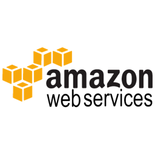

# AWS IAM managed EC2 SSH access 

This approach will sync public ssh keys for user and groups from IAM account to an S3 bucket as authorized_keys files. On the ssh daemon side AuthorizedKeysCommand is used to request authorized keys from S3 bucket on demand on ssh connection establishment. So you can manage all ssh key access to your instances via IAM.


## Setup AWS IAM Account

Create lambda function to sync SSH keys from IAM to S3 This function will also add IAM account as `SSH_KEY_OWNER` environment variable to public keys e.g.

```
environment="SSH_KEY_OWNER=john@example.org" ssh-rsa AAAAB3NzaC1yc2EAAAADAQA...dOXmwPQ== john@example.org
```

### Preparation

- Install [Serverless framework](https://serverless.com/framework/docs/getting-started/)
- Adjust S3 bucketname `<S3Bucket>` within serverless.yml
- Create S3 Bucket

  - Bucket Policy - adjust `<AccountId>` and `<S3Bucket>`

    ```json
    {
        "Version": "2012-10-17",
        "Statement": [
            {
                "Effect": "Allow",
                "Principal": {
                    "AWS": [
                      "arn:aws:iam::<AccountId_1>:root",
                      "arn:aws:iam::<AccountId_2>:root",
                      "arn:aws:iam::<AccountId_3>:root",
                    ]
                },
                "Action": [
                    "s3:ListBucket",
                    "s3:GetObject"
                ],
                "Resource": [
                    "arn:aws:s3:::<S3Bucket>",
                    "arn:aws:s3:::<S3Bucket>/*"
                ]
            }
        ]
    }
    ```

### Deploy

`serverless deploy -v`

## Setup AWS Client Account

### Preparation

- Create Role Policy in Sub Account - adjust `<S3Bucket>`

  ```json
  {
    "Version": "2012-10-17",
    "Statement": [
        {
            "Effect": "Allow",
            "Action": [
                "s3:ListBucket",
                "s3:GetObject"
            ],
            "Resource": [
               "arn:aws:s3:::<S3Bucket>",
               "arn:aws:s3:::<S3Bucket>/*"
            ]
        }
    ]
  }
  ```

- Attach policy to EC2 roles who should be able to access public ssh keys from IAM account

## Setup EC2 Instance

- Set following script as [Instance Userdata](http://docs.aws.amazon.com/AWSEC2/latest/UserGuide/user-data.html)

  ```shell
  #!/bin/bash

  #### SSH Daemon Setup ####

  # adjust ssh daemon config
  cat >> /etc/ssh/sshd_config <<'EOF' 

  LogLevel                   VERBOSE
  PermitUserEnvironment      yes
  AuthorizedKeysCommand      /usr/local/sbin/sshd_authorized_keys_command.sh
  AuthorizedKeysCommandUser  nobody
  EOF

  # create authorized keys command
  cat > /usr/local/sbin/sshd_authorized_keys_command.sh <<'EOF'
  #!/bin/bash

  SSH_USER=$1
  SSH_USER_HOME=$(getent passwd ${SSH_USER} | cut -d: -f6)

  if [ "$SSH_USER" == 'ec2-user' ]; then
    IAM_BUCKET='<S3Bucket>'
    IAM_PRINCIPALS='<IAMPrincipals>'
  fi

  for iam_principal in ${IAM_PRINCIPALS//,/ } ; do 
    aws s3 cp s3://${IAM_BUCKET}/${iam_principal}/authorized_keys -
  done

  EOF
  chmod a+x /usr/local/sbin/sshd_authorized_keys_command.sh
  
  # configure access logging
  cat > /etc/ssh/sshrc <<'EOF'
  #!/bin/bash

  export SSH_KEY_OWNER=${SSH_KEY_OWNER:-'unknown'}

  logger -ip authpriv.notice -t sshd "Public key owner is ${SSH_KEY_OWNER} for connection $(tmp=${SSH_CLIENT% *}; echo ${tmp// / port })"
  echo "Publickey of ${SSH_KEY_OWNER}"

  EOF
  chmod a+x /etc/ssh/sshrc
  
  # restart ssh daemon
  service sshd restart

  ```

  - Ensure AWS CLI is available on EC2 instance, if not prepand `pip install awscli` to Userdata Script
  - Ensure IAM Instance Rolle has acces to IAM S3 Bucket (see above)
  - Configure Userdata Script

    - Set `IAM_BUCKET`, the S3 bucket name where principals are stored e.g. _'company-iam'_

    - Set `IAM_PRINCIPALS`, a comma separated list in form of **groups/[GroupName]** and **users/[UserName]**

      ##### Examples

      - Inline

        ```shell
        IAM_PRINCIPALS='groups/Administrators, user/Admin'
        ```

      - From File - Single principal per line

        ```shell
        IAM_PRINCIPALS=$(cat /home/ec2-user/.ssh/iam_principals | while read line; do echo -n "${line},"; done;)
        ```

      - From AWS Parameter Store
      
        ```shell
        INSTANCE_IAM_ROLE=$(curl -fs http://169.254.169.254/latest/meta-data/iam/security-credentials/)
        INSTANCE_REGION=$(curl -s http://169.254.169.254/latest/meta-data/placement/availability-zone | sed 's/.$//')
        IAM_PRINCIPALS=$(aws ssm get-parameter --region "${INSTANCE_REGION}" --name "/IAM/${INSTANCE_IAM_ROLE}/principals" --query 'Parameter.Value' --output text)
        ```
        
        - Create Prinicpals Parameter `/IAM/<IAM_INSTANCE_ROLE>/principals` within AWS Parameter Store
        - Create Inline Policy for IAM Instance Role to grant access to AWS Parameter Store
        
          ```json
          {
              "Version": "2012-10-17",
              "Statement": [
                  {
                      "Effect": "Allow",
                      "Action": [
                          "ssm:GetParameter",
                          "ssm:GetParameters"
                      ],
                      "Resource": [
                          "arn:aws:ssm:eu-central-1:*:parameter/IAM/<IAM_INSTANCE_ROLE>/*"
                      ]
                  }
              ]
          }
          ```
